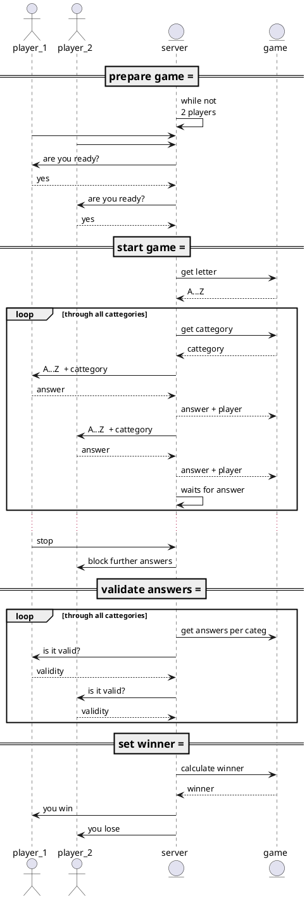

```puml

@startuml 

actor player_1
actor player_2

entity server
entity game
=== prepare game === 
server   -> server : while not \n2 players
player_1 -> server
player_2 -> server
server -> player_1 : are you ready?
return  yes
server -> player_2 : are you ready?
return  yes

=== start game === 
server -> game : get letter
return  A...Z  

loop through all cattegories
server -> game : get cattegory
return  cattegory 

server -> player_1 :A...Z  + cattegory
return answer
server --> game : answer + player
server -> player_2 :A...Z  + cattegory
return answer
server --> game : answer + player
server -> server : waits for answer 

end

...


player_1 -> server : stop

server -> player_2 : block further answers

=== validate answers === 

loop through all cattegories
server -> game : get answers per categ
server -> player_1 : is it valid?
return validity
server -> player_2 : is it valid?
return validity
end

=== set winner === 
server -> game : calculate winner
return winner
server -> player_1 : you win
server -> player_2 : you lose
@enduml

```

