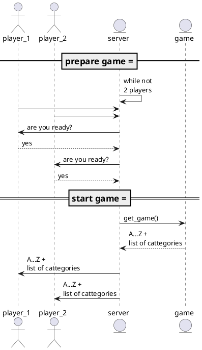

```puml

@startuml 

actor player_1
actor player_2

entity server
entity game
=== prepare game === 
server   -> server : while not \n2 players
player_1 -> server
player_2 -> server
server -> player_1 : are you ready?
return  yes
server -> player_2 : are you ready?
return  yes


=== start game === 
server -> game : get_game()
return  A...Z + \nlist of cattegories

server -> player_1 : A...Z + \nlist of cattegories
server -> player_2 : A...Z + \nlist of cattegories


@enduml

```

