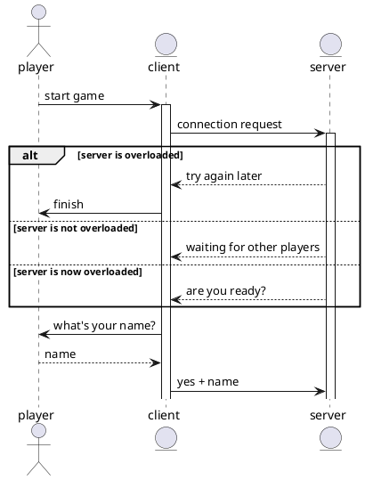
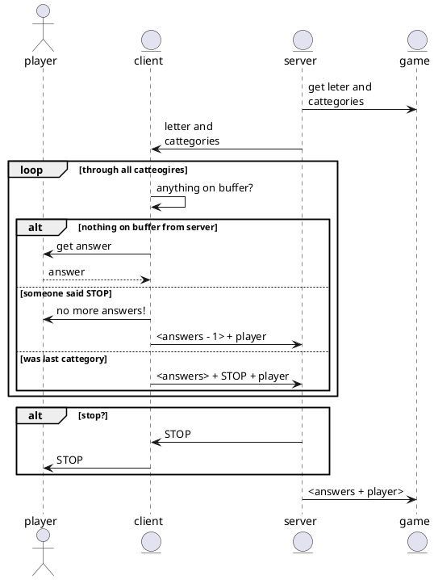

```puml

@startuml 

actor player
entity client
entity server

player -> client : start game

activate client 

client -> server : connection request

activate server

alt server is overloaded
    server --> client : try again later
    client -> player : finish
else server is not overloaded
    server --> client : waiting for other players
else server is now overloaded
    server --> client : are you ready?
end

client -> player : what's your name?
player --> client : name
client -> server : yes + name

@enduml

```

```puml

@startuml 

actor player
entity client
entity server
entity game

server -> game   : get leter and \ncattegories
server -> client : letter and    \ncattegories

loop through all catteogires

    client -> client : anything on buffer?
    alt nothing on buffer from server
        client -> player : get answer
        return answer
    else someone said STOP
        client -> player : no more answers!
        client -> server : <answers - 1> + player
    else was last cattegory
        client -> server : <answers> + STOP + player
    end

end

alt stop?
    server -> client : STOP
    client -> player : STOP
end

server -> game : <answers + player>


@enduml

```

